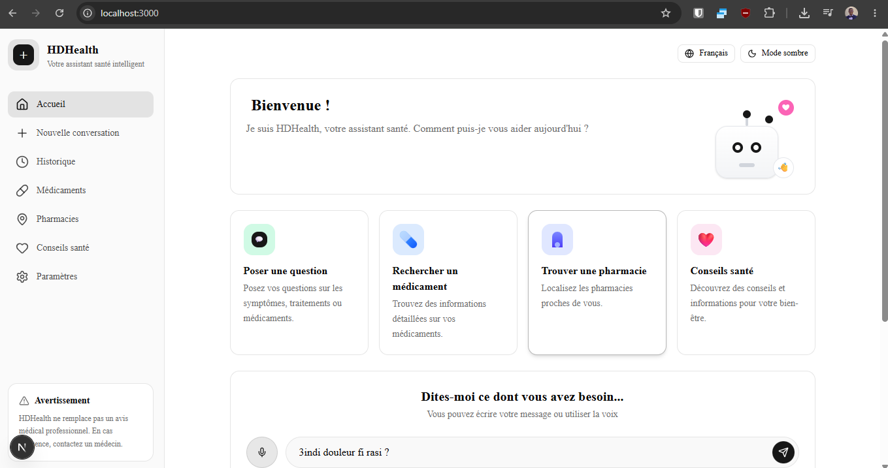
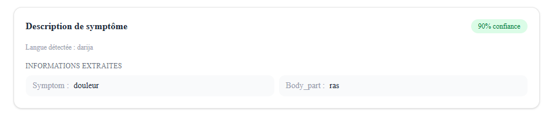

# 🏥 HDHealth  Chatbot Patient Assistance Darija

Auteurs : Djawadi Saindou mblezi · Haitam Fetouhi  
GitHub : [github.com/HaitamF/chatbot_health] (https://github.com/HaitamF/chatbot_health)
https://github.com/Jawad-coder10/chatbot_health

## problematique :
Les chatbots médicaux existants ne supportent pas le Darija marocain — langue informelle, non standardisée et mélangée entre arabe, français et Arabizi — créant une barrière d'accès à l'information médicale pour la population marocaine.

## Solution :

Un assistant intelligent capable de comprendre les demandes médicales des patients marocains dans leur langue naturelle, d'identifier leur besoin et d'extraire les informations clés pour les transmettre sous forme structurée via une API REST.

## Pipeline:

Dataset Darija (1049 phrases)
        ↓
Fine-tuning XLM-RoBERTa
        ↓
Dataset multilingue ( 1219 phrases / AR / FR / EN)
        ↓
Continual Fine-tuning (même modèle)
        ↓
Modèle final — toutes langues
        ↓
Entity extraction (fuzzy + regex)
        ↓
JSON → FastAPI

## 7 Intents supportés

| Intent | Exemple |
--------------------------------------------
| `demande_medicament` | "bghit doliprane" |
| `demande_posologie` | "ch7al nakhod?" |
| `demande_prix` | "ch7al had dwa?" |
| `description_symptome` | "3andi s5ana" |
| `demande_consultation` | "bghit nchuf tbib" |
| `demande_urgence` | "3andi alam qwi" |
| `remboursement_mutuelle` | "wach  3ndkum rma ?" |

## datasets 

Dataset 1 — Darija (intent_final.csv)

1051 lignes · 7 intents · Arabizi + Arabe script
Structure, contenu et annotations créés manuellement
Équilibré : ~150 phrases par intent

Dataset 2 — Multilingue (multilingual_intent.csv)

1219 lignes · 7 intents · Arabe standard + Français + Anglais
Structure et contenu de base créés manuellement
 

Les deux datasets ont la même structure :
text, intent, language
"bghit doliprane", demande_medicament, arabizi
"je voudrais du paracétamol", demande_medicament, french
"أريد دواء للصداع", demande_medicament, arabic

      Variété et volume augmentés via génération LLM(gemini pro // claude )

## Performances

| Métrique | Score |
----------------------
| Accuracy | 0.90 |
| F1 macro | 0.90 |

## Stack technique

- **Modèle NLU :** XLM-RoBERTa (fine-tuning HuggingFace)
- **Entity Extraction :** FuzzyWuzzy + Regex
- **API :** FastAPI
- **Langage :** Python 3.10+

## Structure du projet

chatbot_health/
├── backend/
│   ├── app/
│   │   ├── main.py
│   │   ├── pipeline.py
│   │   ├── classifier.py
│   │   ├── entity_extractor.py
│   │   └── models/
│   │       └── intent_model/
│   ├── datasets/
│   │   ├── intent/
│   │   │   ├── arabizi_intent.csv
│   │   │   ├── arabe_darija.csv
│   │   │   └── intent_final.csv
│   │   └── entity/
│   │       ├── medications.txt
│   │       ├── body_part
│   │       ├── frequency
│   │       └── ...
│   ├── notebooks/
│   │   ├── 01_finetune_darija.ipynb
│   │   └── 02_finetune_multilingual.ipynb
│   └── requirements.txt
├── docker-compose.yml
└── README.md

frontend/
├── app/
│   ├── globals.css
│   ├── layout.tsx
│   └── page.tsx
├── components/
│   ├── ChatBox.tsx
│   ├── ResponseDisplay.tsx
│   ├── theme-provider.tsx
│   ├── hdbot/
│   │   ├── chat-input.tsx
│   │   ├── feature-card.tsx
│   │   ├── feature-icon.tsx
│   │   ├── header-controls.tsx
│   │   ├── index.ts
│   │   ├── logo.tsx
│   │   ├── sidebar-nav-item.tsx
│   │   ├── sidebar.tsx
│   │   ├── warning-box.tsx
│   │   └── welcome-hero.tsx
│   └── ui/
│       ├── accordion.tsx
│       ├── alert-dialog.tsx
│       ├── alert.tsx
│       ├── avatar.tsx
│       ├── badge.tsx
│       ├── button.tsx
│       ├── card.tsx
│       ├── chart.tsx
│       ├── checkbox.tsx
│       ├── dialog.tsx
│       ├── input.tsx
│       ├── label.tsx
│       ├── select.tsx
│       └── ... (autres composants UI)
├── hooks/
│   └── use-mobile.ts
├── lib/
│   ├── api.ts
│   └── utils.ts
├── public/
├── package.json
├── tsconfig.json
├── next.config.ts
├── eslint.config.mjs
├── postcss.config.mjs
├── Dockerfile
├── README.md
├── AGENTS.md
├── CLAUDE.md
└── components.jsonchatbot_health/
├── docker-compose.yml
├── file_structrure.txt
├── README.md
└── requirements.txt
---

## Installation

bash
git clone https://github.com/HaitamF/chatbot_health
cd chatbot_health
docker-compose up --build

Ou sans Docker :

bash
cd backend
pip install -r requirements.txt
uvicorn app.main:app --reload

## Endpoints et resultats 
json :
{
  "intent": "medication_request",
  "confidence": 0.92,
  "input_language": "darija",
  "entities": {
    "medication": "Doliprane",
    "quantity": "3 boites",
    "frequency": "2 fois par jour",
    "duration": null,
    "symptom": null,
    "body_part": null,
    "urgence_type": null,
    "specialite": null,
    "lieu": null,
    "assurance": null
  }
}

 

Le système peut être étendu vers la prise en charge vocale via AtlasIA MoulSot, le diagnostic médical assisté et le support de langues supplémentaires. À terme, il pourrait s'intégrer dans des plateformes de santé digitale marocaines pour améliorer l'accessibilité aux soins.